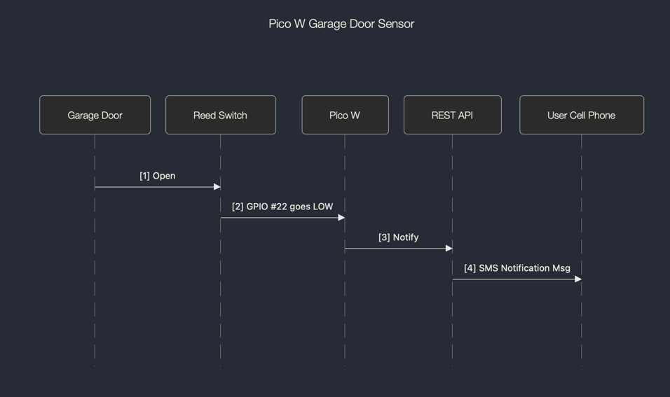

# Pico W Garage Door Sensor

## Why Build This?

I need to be notified when my garage door opens because I frequently have to help my wife carry things from her car
into the house.

## Overview

There are 3 parts: A Raspberry Pi Pico W, a reed switch and a REST API. A "normally closed" reed switch is mounted on
the garage door. The switch is connected to 2 pins on the Pico. One is to the 3v3 power pin (physical pin #36) and
the other to GPIO pin #22 (physical pin #29). When the door opens, the switch connection is broken. This is detected
by the Pico who then sends a POST message to a REST API. The REST API converts that to a text message which is sent
to me (more on that below).

Here is a simple UML diagram to illustrate the progression 

## REST API Details

I have a background in AWS, so I used it to build the REST API. Specifically, it is AWS' API Gateway. It accepts HTTPS
POST messages, routes them to an AWS Lambda function (see the `aws-lamda` directory), which then calls AWS' Simple
Notification Service (SNS) who finally sends an SMS text message to my cell phone.

But AWS is a big, complex, and potentially expensive environment to use. I know most people are not going to delve into
AWS just to build a stupid garage door sensor. Fortunately, there is another option.

The other option is https://pushover.net/. For a small fee, you can send SMS text messages. They also have a REST API
(with sample code). This is the best option for most people. Simply replace my POST request (in `main.py`) with theirs
and you should be fine.

## Parts List

1. [Pico W](https://www.amazon.com/gp/product/B0B72GV3K3/ref=ppx_yo_dt_b_asin_title_o00_s00?ie=UTF8&psc=1)
2. [Project Box](https://www.amazon.com/dp/B07Q14K8YT?ref=ppx_yo2ov_dt_b_product_details&th=1)
3. [Magnetic Tape](https://www.amazon.com/gp/product/B081CZ7V1V/ref=ppx_yo_dt_b_search_asin_title?ie=UTF8&th=1)
4. [Nylon Screws](https://www.amazon.com/gp/product/B017QRA5MW/ref=ppx_yo_dt_b_search_asin_title?ie=UTF8&th=1)
5. [Reed Swtich](https://www.amazon.com/gp/product/B08DV4SQRX/ref=ppx_yo_dt_b_search_asin_title?ie=UTF8&psc=1)
6. [Wire Crimps](https://www.amazon.com/gp/product/B07RW6XVWZ/ref=ppx_yo_dt_b_search_asin_title?ie=UTF8&th=1)
7. [USB Power Supply](https://www.amazon.com/gp/product/B0827V2WT4/ref=ppx_yo_dt_b_search_asin_title?ie=UTF8&th=1)
8. [USB Power Cable](https://www.amazon.com/gp/product/B07TKHLZHT/ref=ppx_yo_dt_b_search_asin_title?ie=UTF8&th=1)
9. [Crimping Tool](https://www.amazon.com/gp/product/B07GFLWKTT/ref=ppx_yo_dt_b_search_asin_title?ie=UTF8&th=1)
10. [Mini Screwdrivers](https://www.amazon.com/gp/product/B07YJG766F/ref=ppx_yo_dt_b_search_asin_title?ie=UTF8&psc=1)
11. [5/64 Drill Bit](https://www.amazon.com/BOSCH-CO2132-Applications-Light-Gauge-High-Carbon/dp/B000AEVY0Q/ref=sr_1_4?crid=1YFLNC6N4WQTE&keywords=5%2F64%2Bdrill%2Bbit&qid=1696537876&s=hi&sprefix=5%2F64%2Ctools%2C125&sr=1-4&th=1)

## Pictures

### Here is the reed switch mounted on the garage door 

### Here is the reed switch and the box which contains the Pico W 

### Here is the back of the box. It has magnetic tape on it and the wall. That way, the box can be secured to the wall but can also be easily pulled off.

### Here is its content.

